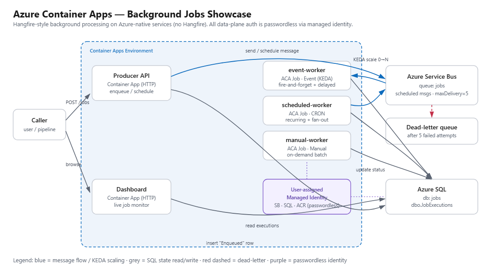
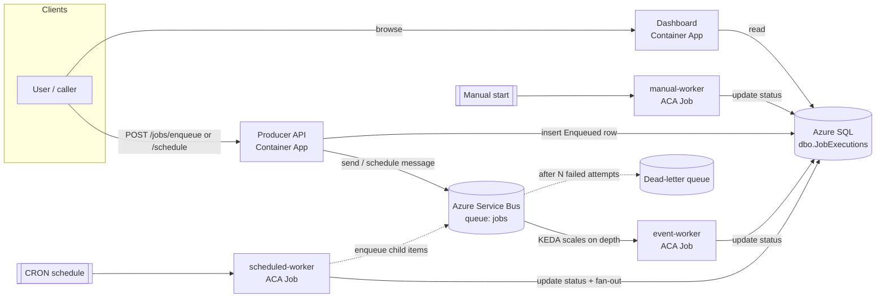

# Azure Container Apps — Background Jobs Showcase

A hands-on demo that shows how to run **background / job-processing workloads on
Azure-native services** — the kind of work teams commonly do today with
[Hangfire](https://www.hangfire.io/). **This repo does not use Hangfire.** It is
a *capabilities* showcase (not a line-of-business app) that maps each Hangfire
concept onto **Azure Container Apps (ACA)** plus a few supporting Azure services,
so you can see what the platform gives you out of the box.

> Context: built for a Brazil app-modernization conversation where .NET / .NET
> Core apps currently run Hangfire on 2 VMs against MS SQL. The goal is to
> understand the Azure-native replacement options. This repo demonstrates the
> **Azure Container Apps** path end-to-end and keeps **Azure SQL** as the store
> to match the existing environment.

---

## What it demonstrates

| Hangfire feature | What you'd write in Hangfire | Azure-native equivalent here |
|---|---|---|
| Fire-and-forget | `BackgroundJob.Enqueue(() => Work())` | `POST /jobs/enqueue` → **Service Bus** → **event-driven ACA Job** (KEDA queue scaler) |
| Delayed | `BackgroundJob.Schedule(() => Work(), delay)` | `POST /jobs/schedule` → **Service Bus scheduled message** → event ACA Job |
| Recurring (CRON) | `RecurringJob.AddOrUpdate(..., Cron.Daily)` | **Scheduled ACA Job** with a `cronExpression` on the platform |
| Ad-hoc / "Trigger now" | Dashboard button | **Manual ACA Job** started via `az containerapp job start` or API |
| Automatic retries | Built-in retry attempts | Service Bus redelivery up to `maxDeliveryCount`, then **dead-letter queue** |
| Dashboard | Hangfire Dashboard UI | **Dashboard Container App** reading job state from Azure SQL (live auto-refresh) |
| Batches / continuations (Pro) | `BatchJob` / `ContinueWith` | Queue-driven **fan-out** (recurring job enqueues child items) |
| Throughput / concurrency | Server worker count | **KEDA** scaling + job `parallelism` + scale-to-zero |
| Storage | Hangfire SQL Server schema | Explicit `dbo.JobExecutions` table in **Azure SQL** |

### Capabilities Hangfire can't match (platform value-add)
- **Scale to zero** — no always-on polling server; workers run only when there is work.
- **Passwordless security** — managed identity to Service Bus & SQL (no connection-string secrets).
- **Independent compute** — each job type is isolated; heavy batches don't affect the web tier.
- **Revisions / blue-green** — ship new job versions as ACA revisions.
- **Platform-native scheduling & eventing** — CRON and queue triggers are infra config, not app code.

---

## Architecture



<details>
<summary>Mermaid source (same diagram)</summary>



</details>

All compute runs in a single **Container Apps Environment**. Auth between
components is **passwordless** via a user-assigned **managed identity**
(Service Bus Data Owner, AcrPull, and a SQL DB user). See
[`docs/comparison.md`](docs/comparison.md) for the detailed Hangfire→ACA mapping
and [`docs/architecture.md`](docs/architecture.md) for component details.

---

## Repository layout

```
src/
  Jobs.Shared/         Shared models, Azure SQL repository, Service Bus sender, processor
  Producer.Api/        HTTP API — Hangfire "client" replacement (enqueue/schedule/stats)
  Dashboard.Web/       Live dashboard — Hangfire dashboard replacement
  Worker.EventJob/     Event-driven ACA Job  (fire-and-forget + delayed)
  Worker.ScheduledJob/ Scheduled ACA Job     (recurring CRON + fan-out)
  Worker.ManualJob/    Manual ACA Job        (on-demand long-running batch)
infra/
  main.bicep           Full environment: ACA env, apps, jobs, Service Bus, Azure SQL, identity, RBAC
  main.parameters.json Sample parameters
scripts/
  deploy.ps1 / deploy.sh   Build images in ACR + deploy Bicep (one command)
  setup-sql.sql            Grant the managed identity access to Azure SQL
  demo.ps1                 Drive traffic through the system to watch the dashboard
```

---

## Prerequisites

- Azure subscription + `az` CLI (logged in: `az login`)
- .NET 9 SDK (to build/run locally)
- Docker (optional — cloud builds use `az acr build`, so a local daemon isn't required)

---

## Deploy (one command)

```powershell
# PowerShell
./scripts/deploy.ps1 `
  -ResourceGroup rg-acajobs `
  -Location eastus `
  -AcrName <globally-unique-acr-name> `
  -SqlAdminPassword (Read-Host -AsSecureString)
```

```bash
# bash
RESOURCE_GROUP=rg-acajobs ACR_NAME=<globally-unique-acr-name> \
SQL_ADMIN_PASSWORD='S3cure-Passw0rd!' ./scripts/deploy.sh
```

The script:
1. Creates the resource group and an ACR (if missing).
2. Builds all five images **in the cloud** with `az acr build`.
3. Deploys `infra/main.bicep`.
4. Prints the Producer + Dashboard URLs and the SQL grant to run next.

Then grant the managed identity access to the DB (one time), connected as the
Entra ID admin the script set (your signed-in user):

```sql
CREATE USER [acajobs-id] FROM EXTERNAL PROVIDER;
ALTER ROLE db_datareader ADD MEMBER [acajobs-id];
ALTER ROLE db_datawriter ADD MEMBER [acajobs-id];
ALTER ROLE db_ddladmin   ADD MEMBER [acajobs-id];
```

(`acajobs-id` = the `managedIdentityName` output; `scripts/setup-sql.sql`
parameterizes this.)

---

## Try it

```powershell
./scripts/demo.ps1 `
  -ProducerUrl https://acajobs-producer-api.<region>.azurecontainerapps.io `
  -ResourceGroup rg-acajobs `
  -ManualJobName acajobs-manual-worker
```

Then open the **Dashboard** URL. You'll see fire-and-forget jobs process almost
immediately (KEDA scales the event worker from zero), delayed jobs appear after
their delay, one job **fail and get retried then dead-lettered**, and the manual
batch job run its items. The scheduled worker runs on its CRON (02:00 UTC) or
can be started on demand:

```bash
az containerapp job start -n acajobs-scheduled-worker -g rg-acajobs
```

### API reference (Producer)

| Method | Path | Purpose |
|---|---|---|
| POST | `/jobs/enqueue` | Fire-and-forget. Body: `{ "jobType": "...", "payload": "{}" }` |
| POST | `/jobs/schedule` | Delayed. Body adds `"delaySeconds": 20` |
| GET | `/jobs` | Recent executions (JSON) |
| GET | `/jobs/stats` | Counts by status |
| GET | `/health` | Liveness |

> Tip: send `"payload": "{\"fail\":true}"` to force a failure and watch the
> retry + dead-letter behavior.

---

## Run locally (optional)

You still need a reachable Azure Service Bus namespace + Azure SQL DB (the
primitives have no full local emulator here). Set the same env vars the
containers use, then `dotnet run` any project:

```powershell
$env:SERVICEBUS_FQNS   = "<ns>.servicebus.windows.net"
$env:SERVICEBUS_QUEUE  = "jobs"
$env:SQL_CONNECTION_STRING = "Server=tcp:<server>.database.windows.net,1433;Database=jobs;Authentication=Active Directory Default;Encrypt=True;"
dotnet run --project src/Producer.Api
```

`DefaultAzureCredential` uses your `az login` locally and the managed identity in Azure.

---

## Build note (Microsoft corp machines)

The committed `NuGet.config` points at `nuget.org`, which is what GitHub Actions
CI uses. On a locked-down corp machine where nuget.org is blocked, restore
against the internal proxy feed instead:

```powershell
dotnet restore AcaBackgroundJobs.slnx --source https://packagefeedproxy.microsoft.io/nuget/v3/index.json
dotnet build AcaBackgroundJobs.slnx --no-restore
```

Cloud image builds (`az acr build`) are unaffected — they restore from nuget.org inside Azure.

---

## Choosing the right Azure service

Azure Container Apps Jobs is the closest 1:1 to Hangfire, but it isn't the only
option. See [`docs/comparison.md`](docs/comparison.md) for when to prefer
**Azure Functions (Timer/Queue/Durable)** or **App Service WebJobs** instead.
The right answer depends on exactly which Hangfire features the workload uses —
worth confirming before committing to a target.

## Disclaimer

Sample/demo code for capability illustration. Not production-hardened (e.g.
review SQL firewall rules, private networking, secret rotation, and scaling
limits before any real use). No customer data is included.
